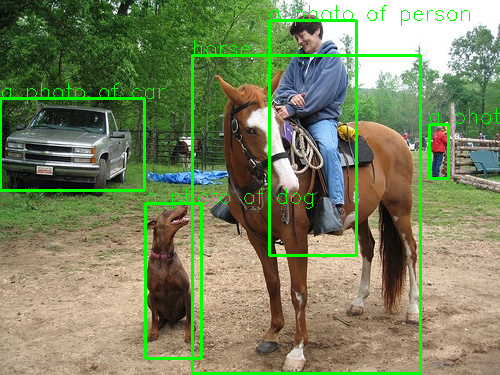

# OWLVIT

[huggingface](https://huggingface.co/docs/transformers/model_doc/owlvit)上介绍

 

## Model
~~~
cd scrips
mkdir weights
~~~
将下面4个模型文件放到weights目录下：
[owlvit-image.axmodel](https://github.com/AXERA-TECH/OWLVIT-ONNX-AX650-CPP/releases/download/v0.1/owlvit-image.axmodel)  # for image encode

[owlvit-image.onnx](https://github.com/AXERA-TECH/OWLVIT-ONNX-AX650-CPP/releases/download/v0.1/owlvit-image.onnx) # for image encode

[owlvit-post.onnx](https://github.com/AXERA-TECH/OWLVIT-ONNX-AX650-CPP/releases/download/v0.1/owlvit-post.onnx) # post process to get logits result

[owlvit-text.onnx](https://github.com/AXERA-TECH/OWLVIT-ONNX-AX650-CPP/releases/download/v0.1/owlvit-text.onnx) # for text encode


## Build
if x86 onnxruntime no ui
```
./build_x86.sh
```
else if x86 onnxruntime ui
```
cd qtproj/OWLVITQT
./build_x86.sh
```
else if ax650
```
./build_ax650.sh
```

### Run
if x86 onnxruntime no ui
```
./run_x86.sh
```
else if x86 onnxruntime ui
```
cd qtproj/OWLVITQT
./run_x86_ui.sh   # 需要有显示器
```
else if ax650
```
scp build/main root@192.168.8.68:/mnt/sdcard/chenhaiwei/owlvit/
scp scripts/weights/owlvit-* root@192.168.8.68:/mnt/sdcard/chenhaiwei/owlvit/
./main --ienc owlvit-image.axmodel --tenc owlvit-text.onnx -d owlvit-post.onnx -v vocab.txt -i ssd_horse.jpg -t text.txt --thread 8

# 结果如下：
Engine creating handle is done.
Engine creating context is done.
Engine get io info is done.
Engine alloc io is done.
[I][                            init][ 280]: BGR MODEL
[I][              load_image_encoder][  17]: input size 768 768
[I][              load_image_encoder][  29]: image feature len 442368
[I][              load_image_encoder][  32]: pred box cnt  576
[I][               load_text_encoder][ 152]: text feature len 512
[I][                            main][ 120]: image_src [ssd_horse.jpg]
[I][                            main][ 121]: text_src [text.txt]
encode text Inference Cost time : 0.190662s
post Inference Cost time : 0.0550382s
a photo of person 268.899292 20.153463 88.163696 235.837906
a photo of person 428.696014 123.745819 19.836823 55.102310
horse 191.756058 55.418949 229.225601 318.581055
a photo of car 0.000000 98.398750 145.470108 92.571877
a photo of dog 145.470108 203.093140 57.306412 156.490570

```
